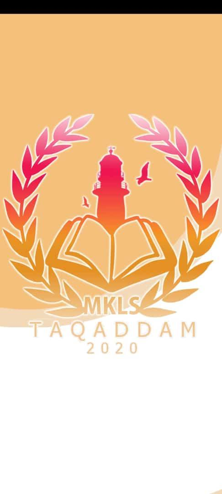
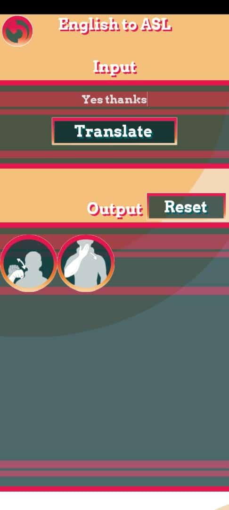

  

<a>
  

    <picture>
      <source media="(prefers-color-scheme: dark)" srcset="Snapshots\mainlogo3.png">
      
    </picture>
  

</a>

# SIGN CHAT
- SIGN CHAT© was a phone application project that transforms written natural languages (e.g., English) to a series of ASL gestures on a grid display and vice versa.
- Development plans included usage of computer vision to implement a real-time detection of hand and facial gestures through the mobile phone's camera.

## DEMO:

## Snapshots:
1. Splash Screen (showcasing our design of the highschool logo)

|  |
|:---:|
| Splash Screen |

2. Main Menu

  
|  |
|:---:|
| Main Menu Screen |
  

3. English to American Sign Language (ASL).

  
|  |
|:---:|
| English to ASL Screen |

## Credits
- [@37743](https://github.com/37743) - **Yousef Gomaa**
- Hady Amr
- Shireen Sabry
- Hana Ahmed
- Fatima

## Final Note:
- This repository is unmaintained and outdated. [^1]
- It is only uploaded for archiving purposes, some files are missing. [^2]

---

 <b> Project is discontinued! </b> 

<a>
  

      <picture>
        <source media="(prefers-color-scheme: dark)" srcset="Snapshots\mainlogo3notext.png">
        
      </picture>
  

</a>

[^1]: I was a terrible programmer back then, extremely sorry for the unreadable/inefficient code.
[^2]: SFX and most of the gestures files.
